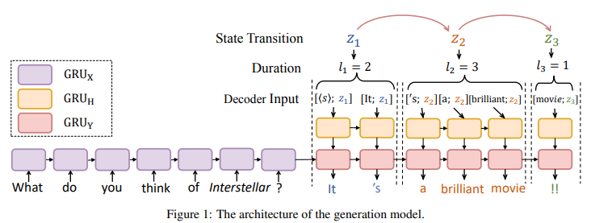

# S2S-Temp

This repository contains the data and code for [Low-Resource Response Generation with Template Prior (EMNLP2019)](https://arxiv.org/abs/1909.11968). The overall architecture is shown in Figure 1.




## Environments

The code has been tested with:
* python 3.6 
* pytorch 0.4.1
* Ubuntu 16.04

## Data and Preparation

**Question Response Generation Task**   The preprocessed data is in [question_data](https://github.com/TobeyYang/S2S_Temp/tree/master/question_data). [question_data/dia_data](https://github.com/TobeyYang/S2S_Temp/tree/master/question_data/dia_data) contains the pair data where the raw data is downloaded from [here](http://coai.cs.tsinghua.edu.cn/file/QGdata.zip). The large scale unpaired question data is under [question_data/zhihu_data](https://github.com/TobeyYang/S2S_Temp/tree/master/question_data/zhihu_data).

**Sentiment Response Generation Task**   The preprocessed data is in [sentiment_data](https://github.com/TobeyYang/S2S_Temp/tree/master/sentiment_data). The paired data is in [sentiment_data/tweet_dia](https://github.com/TobeyYang/S2S_Temp/tree/master/sentiment_data/tweet_dia) and the unpaired data is in [sentiment_data/tweet_data](https://github.com/TobeyYang/S2S_Temp/tree/master/sentiment_data/tweet_dia).

The code assumes that each dataset lives in a directory containing `src_train.txt`, `train.txt`, `src_valid.txt`, and `valid.txt` files. For unpaired data, the `src_train.txt` is patched with `<post>` for each sample. Not that to improve the template learning, we annotate several spans of VP and NP elements for each sentence in `train.txt` and `valid.txt` by Stanford Parser and force the NHSMM not to break them during training with `-seg_cut`, and you can ignore this constraint with `-no_constr`.

## Training
The commands for Question Response Generation task are given below. You can implement the Sentiment Response Generation task in a similar way.

### Learn Template Prior and Build Template Pool
Firstly, you can obtain the template prior (NHSMM) with data in [question_data/zhihu_data](https://github.com/TobeyYang/S2S_Temp/tree/master/question_data/zhihu_data) as follows:

```bash
mkdir models
python chsmm_without_src.py -data question_data/zhihu_data/ -bsz 16 -cuda -emb_size 300 -hid_size 300 -L 4 -K 50 -max_seqlen 35 -vocab_path question_data/vocab.data -seg_cut -unif_lenps -no_mask -seed 1111 -lr 0.5 -save models/hsmm-300-50-4.pt
```

**N.B.** training is somewhat sensitive to the random seed and learning rate, and it may be necessary to adjust seed and learning rate in order to get the best performance.


After training, you can use the Viterbi algorithm to segment sentences to extract templates. To get the segmentation of the training data and build the template pool:

```bash
mkdir segs
python chsmm_without_src.py -label_data -split train -data question_data/zhihu_data/ -bsz 16 -cuda -emb_size 300 -hid_size 300 -L 4 -K 50 -max_seqlen 35 -vocab_path question_data/vocab.data -seg_cut -unif_lenps -no_mask -load models/hsmm-300-50-4.pt.e10 | tee segs/hsmm-300-50-4.pt.e10.segs.pool
```
The above script writes the segmentations to standard output and redirects them to file `segs/hsmm-300-50-4.pt.e10.segs.pool` .

#### Examining and Extracting Templates
The `template_extraction.py` script can be used to extract templates from the segmentations produced as above, and to look at them. In particular, `extract_from_tagged_data()` returns the most common templates, and mappings from these templates to sentences, and from states to phrases. This script is also used in the following response generation.


### Adversarial Training
Before training, You need to extract the templates of responses in the training and validation data by:
```bash
python chsmm_without_src.py -label_data -split train -data question_data/dia_data/ -bsz 16 -cuda -emb_size 300 -hid_size 300 -L 4 -K 50 -max_seqlen 35 -vocab_path question_data/vocab.data -seg_cut -unif_lenps -no_mask -load models/hsmm-300-50-4.pt.e10 | tee segs/hsmm-300-50-4.pt.e10.segs.train
python chsmm_without_src.py -label_data -split valid -data question_data/dia_data/ -bsz 16 -cuda -emb_size 300 -hid_size 300 -L 4 -K 50 -max_seqlen 35 -vocab_path question_data/vocab.data -seg_cut -unif_lenps -no_mask -load models/hsmm-300-50-4.pt.e10 | tee segs/hsmm-300-50-4.pt.e10.segs.valid
```
To improve the training stability, we first pre-train the generator with MLE, then update the generator and discriminator alternatively:
```bash
python gan.py  -data question_data/dia_data -load models/hsmm-300-50-4.pt.e10 -pretrain_gen -pretrained_gen_path models/pretrain_gen.pt -bsz 100 --gpu 0 -pretrain_train_fi segs/hsmm-300-50-4.pt.e10.segs.train -pretrain_valid_fi segs/hsmm-300-50-4.pt.e10.segs.valid -beam_sample -tagged_fi segs/hsmm-300-50-4.pt.e10.segs.pool -gan_path models/generator_adversarial.pt
```

## Generate

The following commands will create a output directory and generate responses of test set:
```
mkdir output_question
python generate.py -gen_from_fi question_data/dia_data/test.post -tagged_fi segs/hsmm-300-50-4.pt.e10.segs.pool -generator models/generator_adversarial.pt.e10 -hsmm models/hsmm-300-50-4.pt.e10 -output output_question | tee output_question/result.txt
```
The outputs are formatted as `{query} ||| {response} ||| {template}` and redirected to `output_question/result.txt`. Generated responses are also saved in `output_question/gen_response.txt`. 

Models and generations with other parameter settings can be obtained analogously. Please see the `.py` scripts for details of model option.


## Citation
If you find the datasets or code useful in your research, please consider citing our [EMNLP2019 paper](https://www.aclweb.org/anthology/D19-1197).
```bash
@inproceedings{yang-etal-2019-low,
    title = "Low-Resource Response Generation with Template Prior",
    author = "Yang, Ze  and
      Wu, Wei  and
      Yang, Jian  and
      Xu, Can  and
      Li, Zhoujun",
    booktitle = "Proceedings of the 2019 Conference on Empirical Methods in Natural Language Processing and the 9th International Joint Conference on Natural Language Processing (EMNLP-IJCNLP)",
    month = nov,
    year = "2019",
    address = "Hong Kong, China",
    publisher = "Association for Computational Linguistics",
    url = "https://www.aclweb.org/anthology/D19-1197",
    doi = "10.18653/v1/D19-1197",
    pages = "1886--1897",
}
```

## References
* [Learning Neural Templates for Text Generation (EMNLP 2018)](https://arxiv.org/abs/1808.10122) [\[code\]](https://github.com/harvardnlp/neural-template-gen)
* A PyTorch implementation of [SeqGAN: Sequence Generative Adversarial Nets with Policy Gradient (AAAI 2017)](https://arxiv.org/abs/1609.05473) [\[code\]](https://github.com/suragnair/seqGAN)